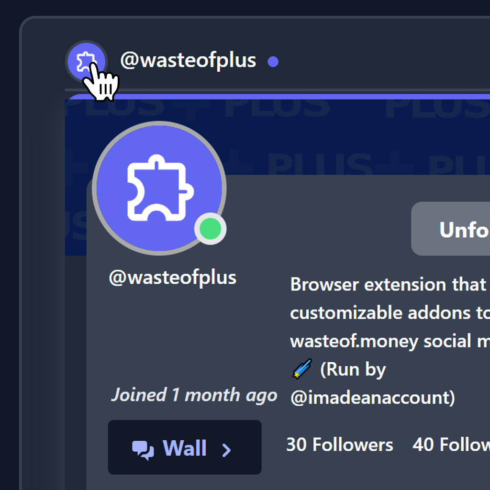
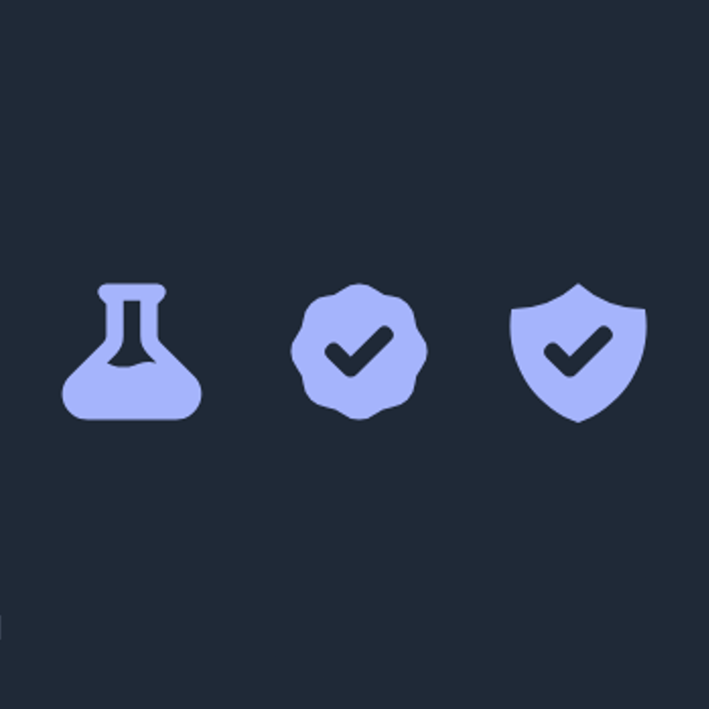
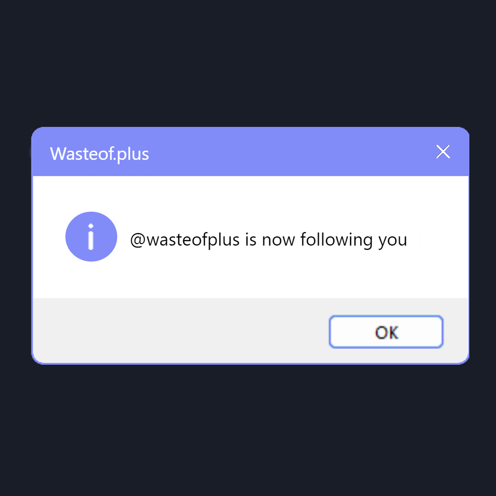
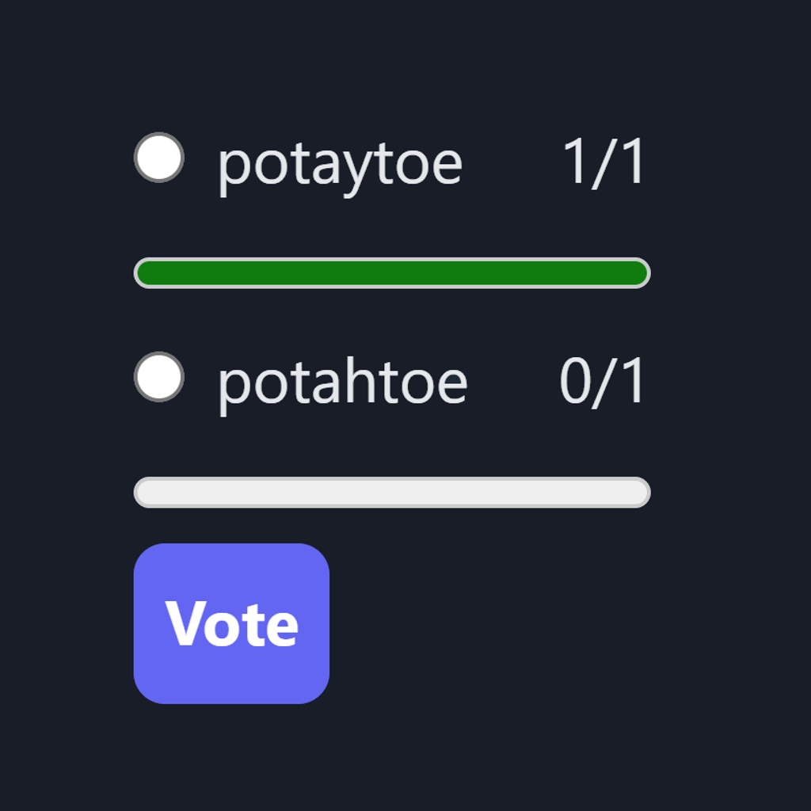

# wasteof.plus

wasteof.plus is a browser extension that adds customizable addons to the wasteof.money social media. 🌠

## Getting Started

Currently, wasteof.plus is not available on the Chrome web store, Edge add-on store, or the Firefox add-on marketplace. You must install it manually using one the following instructions:

### Browser Support

| Chrome             | Edge               | Firefox       | Opera              |
| ------------------ | ------------------ | ------------- | ------------------ |
| ✅ Tested, Working | ✅ Tested, Working | ❌ Not Tested | ✅ Tested, Working |

#### For Chrome, Edge, and Opera:

- Go to the [Releases tab](https://github.com/wasteofplus/wasteof.plus/releases) and download the latest release for your browser platform. Edge, Chrome, and Opera users should download releases marked as "chromium" while FireFox users should use "firefox" releases.
- Extract the Zip file on your device.
- Go to chrome://extensions (or opera://extensions, edge://extensions) in a new browser tab and toggle developer mode so that it's enabled.
- Click "Load Unpacked" and select the the extracted folder.
- There you go! You've successfully installed wasteof.plus. To test it out, try going to [wasteof.money](https://wasteof.money).

#### Firefox

wasteof.plus is still being ported to work in Firefox.

## ✨ Features

- Adds beta, banned, admin, and verified badges next to usernames across the site. (in messages, on your feed, on explore, and on profiles)
- Shows online status dot indicator across the site (same places as above)
- Adds hover cards for user profiles on links
- Adds desktop notifications for new messages
- Adds an extension badge showing the number of new messages and plays a sound effect
- Posts a message in wasteof.money/chat when you leave or enter chat
- Allows you to create and vote in rich polls

### All Addons

| Profile Hover Cards                                                                                                             | User Status Badges                                                                                                               | Unread Messages Badge                                                                                                           | New Message Notifications                                                                                                       |
| ------------------------------------------------------------------------------------------------------------------------------- | -------------------------------------------------------------------------------------------------------------------------------- | ------------------------------------------------------------------------------------------------------------------------------- | ------------------------------------------------------------------------------------------------------------------------------- |
|  |  |  |  |
| Polls                                                                                                                           | Chat Presence Notifier                                                                                                           |                                                                                                                                 |                                                                                                                                 |
|  |   |                                                                                                                                 |                                                                                                                                 |

## 🗺 Roadmap (not in any particular order)

- Typescript
- Clean up code

## Contributing

Find information about contributing code/addons in the [CONTRIBUTING.md](CONTRIBUTING.md) file.

### 📜 License

wasteof.plus is licensed under the BSD-3 license. read it [here](LICENSE). It is primarily maintained by @wasteofplus.

## Motivation

Make wasteof.money better by adding cool community-requested features that may or may not necessarily fit into the base social media and may or may not be wanted by everybody (users have the option to turn on/off addons.)

## Other Projects

Wasteof.plus is inspired by [ScratchAddons](https://github.com/ScratchAddons/ScratchAddons), which is developed by the [ScratchAddons](https://github.com/ScratchAddons) team, and wasteof.mobile by [Micah Lindley](https://github.com/micahlt). Wasteof.money is developed by [jeffalo.](https://github.com/jeffalo)